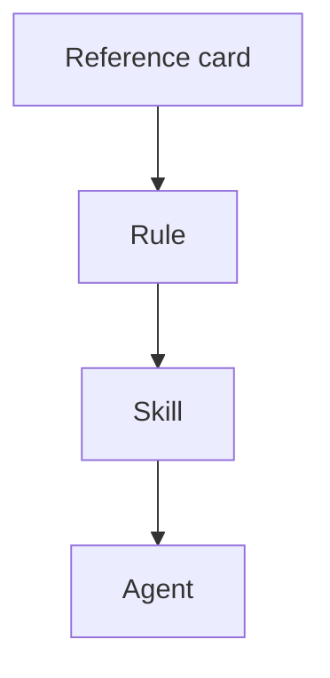

# Rule: Diagram Usage

## Purpose

Use diagrams when they clarify structure, flow, or dependency relationships better than prose.

## Reference links

Authority references:

- [Mermaid Documentation](../../references/mermaid-docs.md)

## Rules

1. Use Mermaid for diagrams that should stay editable inside markdown.
2. Prefer small diagrams that can be reviewed in pull requests.
3. Use tables for comparison and Mermaid for flow, dependency, lifecycle, and sequence relationships.
4. Keep generated images for diagrams that are too visual or too large for Mermaid.

## Supported markdown shape

Use fenced Mermaid blocks:

## Review questions

- Does the diagram show something that prose hides?
- Is the diagram small enough to maintain?
- Are node labels stable and meaningful?
- Would a table be clearer?
